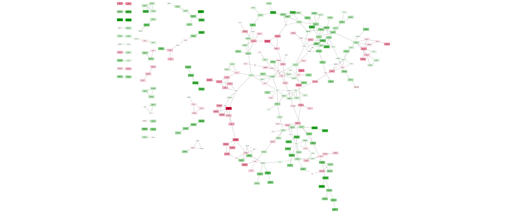

-----------

<br>

## Installing package

This package combines functions from various packages used for analysis of expression data from NGS or expression chips.

So far, this package is only implemented for human data!

The package can be installed via github:

```{r library_private, echo=FALSE, include=FALSE, cache=FALSE}
#require(devtools)
devtools::load_all()
```

```{r library_officical, eval=FALSE}
# make sure the workspace is in pristine condition
rm(list=ls(all=TRUE))

# install package from github
devtools::install_github("ShirinG/exprAnalysis",build_vignettes=TRUE)

library("exprAnalysis")
```

-----------

<br>

# Functions

See package help (?functionname, ?data) for detailed description of functions and example datasets.

-----------

<br>

# Input data

Takes an expression data matrix containing numeric values as expression measures (e.g. read count data, FPKM values, Illumina expression data).

- Rownames should be gene or isoform identifiers (e.g. gene names)
- Colnames should be sample IDs (sample names)

This package contains an example matrix of randomly generated expression data (called **"expmatrix"**).

```{r input, include=FALSE}
#expmatrix <- read.table(system.file("extdata", "Random_exprMatrix.txt", package = "exprAnalysis"), header = TRUE, sep = "\t")
# doesn't exist any more (is now stored as raw data)
```

```{r input_data}
data("expmatrix")
```

-----------

<br>

## Starting from FPKM data

If you have FPKM data (e.g. quantile normalized) from Cufflinks, treat the data such as the **expmatrix** example.

-----------

<br>

## Starting from count data

If you want to do count data analysis, you can either produce a count matrix (e.g. with HTSeq) and proceed to DESeq2 analysis or you can produce the count table directly from the bam files and then proceed to DESeq2. 

read_bam_to_countmatrix() returns a DESeq data frame that can directly be used with the DEseq2 pipeline. Or you can manually load the count matrix that was saved by read_bam_to_countmatrix() and then go to DESeqDataFrameFromMatrix().

```{r countdata_bam, eval=FALSE}

# Locate alignment files

dir <- getwd()
fileslist <- list.files(dir)
filenames <- fileslist[grep(".*sorted.bam$", list.files(dir))]

# Create a sample table

samplename <- sub("_accepted_hits.sorted.bam", "", filenames)
design <- c("Treatment", "Control")
sampleid <- sub("Sample", "", samplename)

sampleTable <- data.frame(row.names = samplename, sampleid = sampleid, filenames = filenames, colData = design, stringsAsFactors = F)

#         sampleid                         filenames    colData
#Sample1         1  Sample1_accepted_hits.sorted.bam  Treatment
#Sample2         2  Sample2_accepted_hits.sorted.bam    Control

data <- read_bam_to_countmatrix(sampleTable, gtffile = "/media/data/Public/ENSEMBL.rel.83/Homo_sapiens.GRCh38.83.gtf", projectfolder = getwd(), outPrefix="Test")

```

-----------

<br>

## Starting from Affymetrix expression chips

If you have CEL files, start with the following code to produce the expression matrix and then treat it like the **expmatrix** example:

```{r Affymetrix, include=FALSE}


```

-----------

<br>

## Starting from Illumina expression chips

If you have Illumina intensity data, load it into GenomeStudio first:

- Open New Project -> Gene Expression
- Choose Assay Type -> Next
- Choose Project Repo and name the project -> Next
- On the left side, mark all folders containing data, select "All" and import them into the right window -> Next
- Name Group Set, on the left side, mark all folders containing data, select "All" and import them into the right window (optionally, you can directly create groups here) -> Next
- For now, don't use normalisation and don' substract background
- Choose appropriate Content Descriptor (e.g. HumanHT-12_V4_0_R1_15002873_B.bgx) -> Finish
- Export SampleProbeProfile.txt: Choose columns AVG_Signal, Detection Pval, BEAD_STDERR and Avg_NBEADS
- Export ControlProbeProfile.txt: Choose columns AVG_Signal and Detection Pval
- You also need the Samplesheet.csv
- Follow Frank's Pipeline until you obtain **BSDlog2norm**. From here on, you could treat it like the **expmatrix** example.

-----------

<br>

# Batch correction


-----------

<br>

# Exploratory analysis of all genes

## Variance vs mean gene expression across samples

Plots variance against mean gene expression across samples and calculates the correlation of a linear regression model.

```{r var_vs_mean, fig.width=5, fig.height=5}
var_vs_mean(expmatrix)
```

-----------

<br>

## Principle Component Analysis

Uses functions as implemented by **"pcaGoPromoter"**.

You can only plot the principle components using:

```{r pca_plot, eval=TRUE, fig.width=6, fig.height=6}
groups <- as.factor(c(rep("control",4), rep("TolLPS",4), rep("TolS100A8",4), rep("ActLPS",4)))

pca_plot(expmatrix, groups)
```

or you can plot the principle components and calculate TF and GO term enrichments of genes (defaults to top 2.5%) with highest and lowest loadings. With this function, the ouput files are directly saved to .pdf and .txt (by default to working directory).

```{r pca_plot_enrich, eval=FALSE}
pca_plot_enrich(expmatrix, groups)
```

-----------

<br>

## Hierarchical Clustering and outlier detection

Uses adjacency matrix function from **"WGCNA"** and hierarchical clustering from **"flashClust"**.

```{r wgcna_sample_dendrogram, eval=TRUE, fig.width=8, fig.height=5}
datTraits <- data.frame(Ctrl = c(rep(1, 4), rep(0,12)), TolPS = c(rep(0, 4), rep(1, 4), rep(0, 8)), TolS100A8 = c(rep(0, 8), rep(1, 4), rep(0, 4)), ActLPS = c(rep(0, 12), rep(1, 4)), Tol = c(rep(0, 4), rep(1, 8), rep(0, 4)), row.names = colnames(expmatrix))

wgcna_sample_dendrogram(expmatrix, datTraits)
```

-----------

<br>

## Heatmaps

```{r heatmaps, eval=TRUE}
heatmaps(expmatrix[1:100,], samplecols = rep(c("#E41A1C", "#377EB8", "#4DAF4A", "#984EA3"), each=4))
```

-----------

<br>

## WGCNA


-----------

<br>

# Differential expression analysis

## DE analyis using limma

For normalized expression data (FPKM from Cufflinks or intensities from expression chip arrays).

```{r diff_limma, eval=FALSE, warning=FALSE}
design <- data.frame(Ctrl = c(rep(1, 4), rep(0,12)), TolLPS = c(rep(0, 4), rep(1, 4),
              rep(0, 8)), TollMRP8 = c(rep(0, 8), rep(1, 4), rep(0, 4)), ActLPS = c(rep(0, 12),
              rep(1, 4)), row.names = colnames(expmatrix))
groupcomparisons=c("TolLPS-Ctrl", "TollMRP8-Ctrl", "ActLPS-Ctrl")
DEgenes_all <- diff_limma_all(expmatrix, design, groupcomparisons)

comparison="TolLPS-Ctrl"
DEgenes_pw <- diff_limma_pairwise(expmatrix, design, comparison)

Allgenes_limma_pw <- diff_limma_pw_unfiltered(expmatrix, design, comparison)
```

Example output files from diff_limma functions have been saved to the package data and can be accessed via:

```{r diff_limma_output, eval=FALSE}
data("DEgenes_pw")
data("Allgenes_limma_pw")
```

-----------

<br>

## DE analyis using DESeq2

For raw read count data.

-----------

<br>

## Gene annotations

Can be used to add e.g. ENTREZ ID, ENSEMBL ID, etc. to gene name.

```{r geneAnnotations, eval=FALSE}
geneAnnotations(input=DEgenes_pw, keys=row.names(DEgenes_pw), column=c("ENTREZID", "ENSEMBL"), keytype="SYMBOL")
```

-----------

<br>

## Enrichment Analysis using clusterPofiler

```{r clusterProfiler, eval=FALSE}

x <- rownames(DEgenes_pw)[1:500]
eg = clusterProfiler::bitr(x, fromType="SYMBOL", toType="ENTREZID", OrgDb="org.Hs.eg.db")

geneList <- merge(eg, DEgenes_pw[1:500,"logFC", drop = FALSE], by.x = "SYMBOL", by.y = "row.names", all = TRUE)
gene <- geneList$ENTREZID

#gene <- geneList$ENTREZID[abs(geneList$logFC) > 2]

## Group GO
ggo <- clusterProfiler::groupGO(gene     = gene,
                                OrgDb    = org.Hs.eg.db,
                                ont      = "BP",
                                level    = 3,
                                readable = TRUE)
head(summary(ggo))
barplot(ggo, drop=TRUE, showCategory=12)

# GO over-representation test
ego <- clusterProfiler::enrichGO(gene          = gene,
                                 #universe      = names(geneList),
                                 OrgDb         = org.Hs.eg.db,
                                 ont           = "BP",
                                 pAdjustMethod = "BH",
                                 pvalueCutoff  = 0.01,
                                 qvalueCutoff  = 0.05, 
                                 readable      = TRUE)
head(summary(ego))
barplot(ego, showCategory=8)
dotplot(ego)
enrichMap(ego)
#cnetplot(ego, categorySize="pvalue", foldChange=geneList)
plotGOgraph(ego)

# enrichGO test the whole GO corpus and enriched result may contains very general terms. With dropGO function, user can remove specific GO terms or GO level from results obtained from both enrichGO and compareCluster.


## KEGG over-representation test
kk <- enrichKEGG(gene         = gene,
                 organism     = 'hsa',
                 pvalueCutoff = 0.05)
head(summary(kk))
barplot(kk, showCategory=8)
dotplot(kk)
#cnetplot(kk, categorySize="geneNum", foldChange=geneList)

```


-----------

<br>

## Pathview

For Toll-like-receptor signaling:

```{r pathview, eval=FALSE}
pathview_func(DEgenes_pw, pathway.id = "04620", out.suffix = "DE_TolLPS")
```

-----------

<br>

## Venn diagrams and Biological theme comparison

With **"gplots"** (installed by package).

Example:

```{r venn, eval=TRUE}
venn_list <- list(genelist1 = na.omit(rownames(DEgenes_pw)[1:50]), genelist2 = na.omit(rownames(DEgenes_pw)[30:80]), genelist3 = na.omit(rownames(DEgenes_pw)[48:100]))

gplots::venn(venn_list, show.plot=TRUE, small=0.7, showSetLogicLabel=FALSE, simplify = TRUE)

mtext("If you want a header, put it here", side=3, cex = 0.8)
```

```{r compareCluster, eval=FALSE}
## Biological theme comparison
compGO <- clusterProfiler::compareCluster(geneCluster   = venn_list,
                                          fun           = "enrichGO",
                                          ont           = "BP",
                                          OrgDb         = org.Hs.eg.db,
                                          qvalueCutoff  = 0.001,
                                          pAdjustMethod = "BH",
                                          readable      = TRUE)


compKEGG <- clusterProfiler::compareCluster(geneCluster   = venn_list,
                                            fun           = "enrichKEGG",
                                            qvalueCutoff  = 0.05,
                                            pAdjustMethod = "BH")
compKEGG <- clusterProfiler::setReadable(compKEGG, OrgDb = org.Hs.eg.db)


compMKEGG <- clusterProfiler::compareCluster(geneCluster   = venn_list,
                                             fun           = "enrichMKEGG",
                                             organism='hsa', minGSSize=1)

compDO <- clusterProfiler::compareCluster(geneCluster   = venn_list,
                                          fun           = "enrichDO",
                                          qvalueCutoff  = 0.05,
                                          pAdjustMethod = "BH",
                                          readable      = TRUE)

# For visualisation see Enrichment Analysis using clusterProfiler
```

-----------

<br>

# Networks

## TF networks

This function produced two output files:

- The .expression matrix of TF expression data. 

It will have to be opened with Biolayout3D: 
Set Minimum Correlation and Correlation metric (by default 0.7 and Pearson). Then choose a suitable correlation coefficient (Graph Degree Distribution should be close to linear). Save the resulting network as a TGF file.

Open the TGF file in Cytoscape: Open network from file. Then got to Advanced Options: untick "Use first column names" and add " to "Other:". Now set Column 2 as Source and Column 5 as Target.

- The node annotation table in .txt format.

In cytoscape, open table from file, import data as Node Table Columns. You can then customize the look of your network.

For example, go to Style and 

- go to Border Paint, Column: DE, Mapping type: Discrete and choose a color for 1 and 0

- go to Fill Color, Column logFC, Mapping Type: Continuous and choose colors.

```{r networks, eval=FALSE}
TF_networks(expmatrix, nodeAnno=Allgenes_limma_pw)
```



-----------

<br>

## BiNGO (Cytoscape)

- Go to Cytoscape

- Apps -> BiNGO

- The BiNGO Settings panel pops up. Start by filling in a name for your cluster. This name will be used for creating the output file and the visualization of the results in Cytoscape.

- Check Paste Genes from Text and paste gene names into field below

- We want to assess overrepresentation of GO categories, and we want to visualize the results in Cytoscape. The corresponding boxes are checked accordingly by default. Then select a statistical test (the Hypergeometric Test is exact and equivalent to an exact Fisher test, the Binomial Test is less accurate but quicker) and a multiple testing correction (we recommend Benjamini & Hochberg's FDR correction, the Bonferroni correction will be too conservative in most cases), and choose a significance level, e.g. 0.05. Since we only want to visualize those GO categories that are overrepresented after multiple testing correction, and their parents in the GO hierarchy, select the corresponding visualization option. We're interested in assessing the overrepresentation of functional categories in our cluster with respect to the whole genome, which is why we choose the Complete Annotation as the reference set. 

- Select GO _Biological _Process from the ontology list, and Human from the organism list. We want to consider all evidence codes, so don't fill in anything in the evidence code box. 

- Finally, select a directory to save the output file in (the file will be named test.bgo if you filled in test as a cluster name), and press Start BiNGO...
 
- The program will inform you of its progress while parsing the annotations and calculating the tests, corrections and layout. Finally, a visualization of the overrepresented GO categories is created in Cytoscape. Uncolored nodes are not overrepresented, but they are the parents of overrepresented categories further down. Yellow nodes represent GO categories that are overrepresented at the significance level . For more significant p-values, the node color gets increasingly more orange (see also the Color Legend panel). If you'd like another layout, e.g. hierarchical, select the corresponding option from the Cytoscape Visualization menu. Regardless of the layout you choose, you'll probably have to tweak the nodes a little in order to avoid overlapping node labels. The list of significantly overrepresented functional categories is shown in the BiNGO output window (more information on the cluster and options you selected, and on which genes did not produce any annotation, is stored in the test.bgo file).

-----------

<br>

# Other functions

## Hypergeometric test for enrichment

Analogous to Fisher's Exact Test.

```{r phyper, eval=FALSE}
phyper(SampleSuccesses -1, PopulationSuccesses, PopulationSize - PopulationSuccesses, sampleSize, lower.tail = FALSE)
```

-----------

<br>

```{r render, eval=FALSE, echo=FALSE}
rmarkdown::render('vignettes/exprAnalysis.Rmd', output_file = 'U:/exprAnalysis_test/exprAnalysisVignette.html')

browseVignettes(package = 'ExpressionAnalysis')
```


## Session Info

```{r sessionInfo, echo=TRUE}
sessionInfo()
```